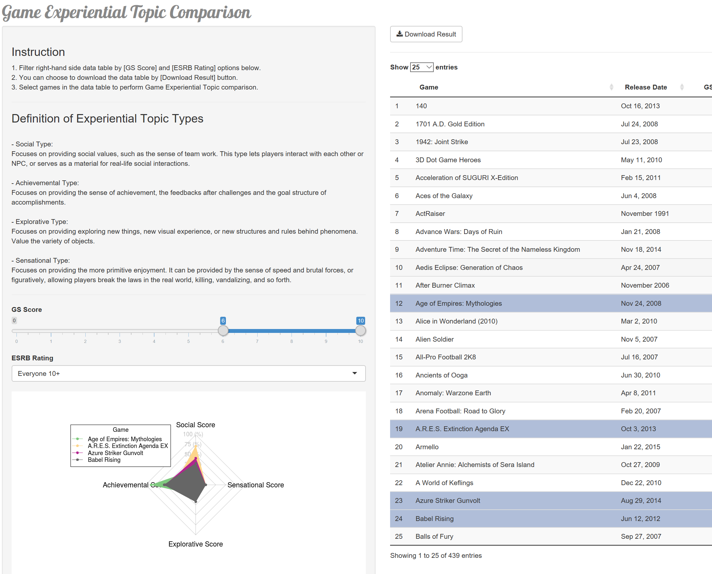

```{r setup, include = FALSE}
knitr::opts_chunk$set(cache = TRUE, warning = FALSE)
```

```{r include = FALSE}
library(tidytext)
library(tidyverse)
library(SnowballC)
library(feather)

# Load stop word dictionery
data(stop_words)
```

# Overview
This research aims at knowing more about video game in general. It examines the relationship between *sentiments* existed in video game's product consumptive experience, which is examined through online game reviews, and its product evaluation score, a general indicator of *product satisfaction*, and the moderating role of *game experiential categories*. We hypothesize and partially verify a positive relationship between positive emotions and product evaluation score, and, on the other hand, a negative relationship between negative emotions and product evaluation score. We also examine the confound effect of game experiential categories on the relationship in the afore-mentioned hypotheses.

# Literature Review
Emotions in product consumption has long been treated as an important part in the consumptive experience as a whole. Product experience contains emotional experience, along with aesthetic experience and experience of meaning (Desmet and Hekkert 2007). Some scholars even define user experience as dynamic internal and emotional state of a user which happens when and after interactions with products (Hassenzahl and Marc 2008).  

Emotions are central due to their critical role in influencing customers interacting with products, which often play triggers of thinking, which influence product evaluation (Wood and Moreau 2006). Many literatures confirm this relationship. Oliver argues that positive and negative emotional affect’s effect on product satisfaction (1994), while Gorn, Goldberg, and Basu claim mood’s influence on consumers’ product evaluation process even when the mood is not directly aroused by the product itself (1993).  

In the first half of This research, we intend to examine this highlighted relationship between emotions during consumption and product satisfaction. On top of that, we apply this examining process to games with different game experiential topics, and observe the differences in between.

# Hypotheses
### Hypothesis 1  
Positive emotions, including anticipation, joy, surprise, and trust, in video game's product consumptive experience, positively influence video games' performance in product evaluation score.

### Hypothesis 2  
On the contrary, negative emotions, including anger, disgust, fear, and sadness, in video game's product consumptive experience, negatively influence video games' performance in product evaluation score.

### Hypothesis 3
The effects described in Hypothesis 1 and Hypothesis 2 are moderated by game experiential categories. In other words, One sensation could have varied effects on product evaluation score of games of different game experiential categories.

# Data and Method
In this research, product satisfaction is proxied by a general evaluation score provided along with online product reviews. On the other hand, emotions are more difficult to be measured due to the ephemeral nature (Khalid and Helander 2006). Scholars propose different ways approximate them by methods such as retrospective interview and activity experience sampling (Bevan 2009). Based upon that, this research attempts to capture the emotional snapshot (Vermeeren et al. 2010) by examining emotional words employed in video game online text reviews from GameSpot (www.gamespot.com), one of the major game information platform in the U.S.. Game experiential categories are defined by an array of scores developed from LDA model. It analyzes online product review texts and infers the experiential categories from latent text topics.


## Read data and tokenize
This analysis draws upon 5,549 professional English game reviews from GameSpot (www.gamespot.com), which we scrape drectly from the website and represents more than 5,000 video games published from 2000-2016. After reading the dataset into R, we change the encoding to ASCII, tokenize the text into single words, remove stop words provided by **tidytext** package, and transform words into stem forms by **SnowballC** package. The words belonging to the Game title in the corresponding review article is also removed to eliminate natural bias of mentioning names of the games in their reviews.  


The tidied dataset ready for analysis contains 1,786,690 observations (words). At the meantime, each games' general review score is acquired from the same website, too. It comes from professional evaluation performed by that same game information website (GameSpot).

```{r warning = FALSE, message = FALSE, warning = FALSE}
# Main dataset
  # Read data, adjust encoding, remove duplicate data
  text_raw <- read_csv("../data/df_cb_main.csv") %>%
    mutate(Review = iconv(Review, "ASCII", "UTF-8")) %>%
    transmute(GameTitle = `Game Title`, Review, GSScore = `GS Score`, ESRB, ReleaseDate = `Release Date`) %>%
    arrange(GameTitle, GSScore) %>%
    distinct(GameTitle, .keep_all = TRUE)
  
  # Remove game title words in each review
  title_tidy <- text_raw %>%
    mutate(TitleToken = GameTitle) %>%
    unnest_tokens(word, TitleToken) %>%
    select(GameTitle, word)
  i <- 1
  for(title in text_raw$GameTitle){
    title_tidy_single <- filter(title_tidy, GameTitle == text_raw[[1]][i])
    for(titleText in title_tidy_single$word){
      filterTextS = paste("(^(", titleText, ") )", sep = "")
      filterTextO = paste("(( ", titleText, "))", sep = "")
      text_raw[i, 2] <- gsub(filterTextS, "", text_raw[i, 2], ignore.case = TRUE)      
      text_raw[i, 2] <- gsub(filterTextO, "", text_raw[i, 2], ignore.case = TRUE)   
    }
    i <- i + 1
  }
  
  # Tokenize review, remove stop words, stem words
  text_tidy <- text_raw %>%
    unnest_tokens(word, Review) %>%
    anti_join(stop_words, by = "word") %>%
    mutate(word = wordStem(word))
  
  # Remove frequent general topic words
  wordSieve = c("game", "games", "game's", "play", "feel", "time", "experience", "makes")
  text_tidy <- text_tidy %>%
    filter(!word %in% wordSieve)
```

Tf-idf index is applied to measure how much information a word provides. The strongest words as shown in the graph contains many experiencial words such as trust, people, spacious, and arduous. This illustrates one of video games' core value, providing emotions to the players.
```{r warning = FALSE}
  # Generate tfidf index
  text_tfidf <- text_tidy %>%
    group_by(GameTitle) %>%
    count(word, sort = TRUE) %>%
    bind_tf_idf(word, GameTitle, n)
```

## Method
This analysis calculates emotional scores of each game review by words' tfidf indicator. The relationship between those emotional scores and the general evaluation scores is then examined by general additive model, which provides the best fit after comparing with randon forest and linear regression methods. All models' effectiveness is examined, and their robustness is evaluated by applying 5-fold cross validation and a training and testing sample division. Lastly, for topic analysis, LDA is adopted to extract the four major topics from the input of game review texts. 

# Conclusion
At the last part of our analysis, we not only find some interesting evidence which could prove our topic model reasonable and convincing to some extent, also we get some very inspiring ideas about different kinds of video games. Through our analysis, we make it clear that for all kinds of games, the feeling of trust and joy could make a significant influence on the evaluation. While we should also notice the difference among the different game types. For those games which involve a lot of plots about adventures and exploration, bringing positive feeling is much more important than avoiding the negative experience. While for those developer who are trying to design a game providing a lot of sensational enjoyment, never makes your player feel sad if you want to get a good evaluation.

# Concerns and Future Research
Through the operations, the model reveals several of its limitations which researchers have to tackle with in further studies (like in my final project). One of the most critical is the somewhat weak explanatory power of emotions on the general evaluation score. The experiential topics developed from LDA do not provide a strong interpretation in game experience, instead, they inclined to conform to and verify the traditional game categories. I argue that the models obviously need more control variables or advanced data processes, such as a further categorization of the meaning of words, to stand out the effects of experience and sentiments. We are also considering apply tools such as Principal Component Analysis to reduce and concentrate the dimentionality before employing the LDA method. 

Indeed, the weak relationship between emotions and general evaluation scores could also attribute to vodeo games' special product characteristic which provide emotional satisfaction through not only positive but also negative emotions such as fight against bosses and killing enemy. This could potentially mitigate negative emotions' negative effects on the general score. Future research in other types of products is suggested for better clarification.

# Bonus
## An App of Game Experiential Topic Comparison
This is an app built upon the game data we apply in our research. In the app, you are allowed to filter games by GS Score and ESRB Rateing, and explore and compare the target games experiential composition in terms of the four topics we developed.  

The app can be access anytime from here [here](https://chihyuchiang.shinyapps.io/game_experiential_topic_comparison_shiny/), or the botton **Exploratory
App** locates at the site's navigation bar.


# Reference
Bevan, N. (2009). *What is The Difference Between The Purpose of Usability and User Experience Evaluation Methods?* Interact 2009, (August), 1–4.  

Vermeeren, A. P. O. S., Law, E. L., Roto, V., Obrist, M., Hoonhout, J., & Väänänen-Vainio-Mattila, K. (2010). *User experience evaluation methods.* Proceedings of the 6th Nordic Conference on Human-Computer Interaction Extending Boundaries - NordiCHI ’10, (July 2015), 521. http://doi.org/10.1145/1868914.1868973  

Hassenzahl, M. (2008). *User experience (UX): Towards an experiential perspective on product quality.* Proceedings of the 20th International Conference of the Association Francophone d’Interaction Homme-Machine on - IHM ’08, 11–15. http://doi.org/10.1145/1512714.1512717  

Gorn, G. J., Goldberg, M. E., Basu, K., Gorn, G. J., & Goldberg, M. E. (2016). Stable URL : http://www.jstor.org/stable/1480228 *Mood , Awareness , and Product Evaluation*, 2(3), 237–256.  

Wood, S. L., & Moreau, C. P. (2006). *From Fear to Loathing? How Emotion Influences the Evaluation and Early Use of Innovations.* Journal of Marketing, 70(3), 44–57. http://doi.org/10.1509/jmkg.70.3.44  

Desmet, P. M. a., & Hekkert, P. (2007). *Framework of product experience.* International Journal of Design, 1(1), 57–66. http://doi.org/10.1162/074793602320827406  

Khalid, H. M. (2006). *Customer Emotional Needs in Product Design.* Concurrent Engineering, 14(3), 197–206. http://doi.org/10.1177/1063293X06068387  

Oliver, R. L. (1994). *Conceptual Issues in the Structural Analysis of Consumption Emotion, Satisfaction, and Quality: Evidence in a Service Setting.* Advances in Consumer Research, 21(1977), 16–22.
